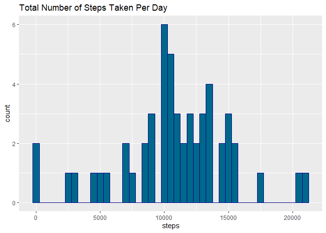
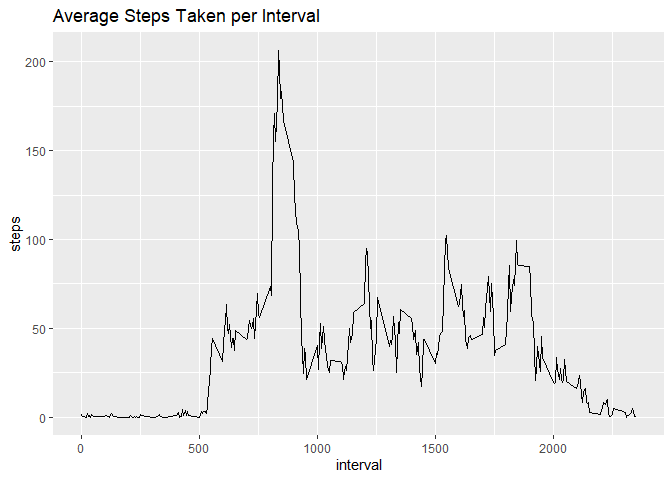
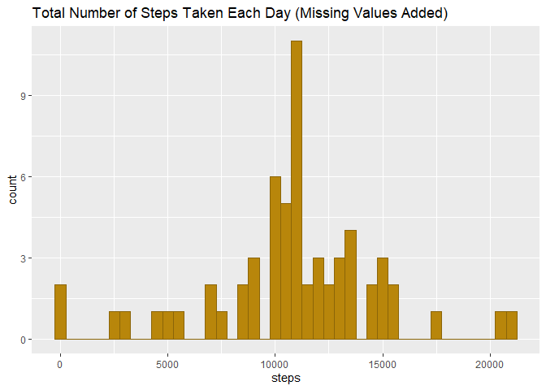
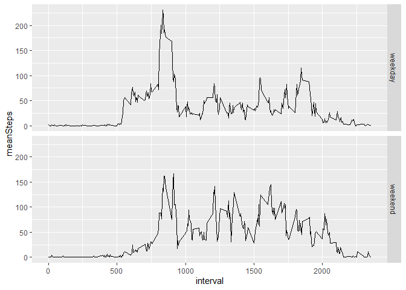

# Assessment 1 (Reproducible Research) - Activity Monitoring

### 1) Loading and preprocessing the data
Loading the data:

``` r
activity <- read.csv("activity.csv", header = TRUE, colClasses = c("numeric", "Date", "numeric"))
head(activity)
```

```
##   steps       date interval
## 1    NA 2012-10-01        0
## 2    NA 2012-10-01        5
## 3    NA 2012-10-01       10
## 4    NA 2012-10-01       15
## 5    NA 2012-10-01       20
## 6    NA 2012-10-01       25
```
Processing the data into a format suitable for analysis by removing NA values:

``` r
activity_noNA <- na.omit(activity)
head(activity_noNA)
```

```
##     steps       date interval
## 289     0 2012-10-02        0
## 290     0 2012-10-02        5
## 291     0 2012-10-02       10
## 292     0 2012-10-02       15
## 293     0 2012-10-02       20
## 294     0 2012-10-02       25
```

### 2) What is mean total number of steps taken per day?
Calculate the total number of steps taken per day:

``` r
steps_per_day <- aggregate(steps~date, activity_noNA, sum)
head(steps_per_day)
```

```
##         date steps
## 1 2012-10-02   126
## 2 2012-10-03 11352
## 3 2012-10-04 12116
## 4 2012-10-05 13294
## 5 2012-10-06 15420
## 6 2012-10-07 11015
```
Make a histogram of the total number of steps taken per day:

``` r
library(ggplot2)
ggplot(data = steps_per_day) +
  geom_histogram(aes(steps), binwidth = 500, fill = "deepskyblue4", col = "darkblue") +
  ggtitle("Total Number of Steps Taken Per Day")
```

<!-- -->

Calculate and report the mean and median of the total number of steps taken per day:

``` r
mean(steps_per_day$steps)
```

```
## [1] 10766.19
```

``` r
median(steps_per_day$steps)
```

```
## [1] 10765
```

### 3) What is the average daily activity pattern?
Make a time-series plot of the 5-minute interval (x-axis) and the average number of steps taken, averaged across all days (y-axis):

``` r
activity_per_interval <- aggregate(steps~interval, activity_noNA, mean)
ggplot(data = activity_per_interval) + 
  geom_line(aes(interval,steps)) +
  ggtitle("Average Steps Taken per Interval")
```

<!-- -->

Which 5-minute interval, on average across all days in the dataset, contains the maximmum number of steps?

``` r
activity_per_interval[which.max(activity_per_interval$steps),]
```

```
##     interval    steps
## 104      835 206.1698
```

### 4) Imputing missing values
Calculate and report the total number of missing values in the dataset:

``` r
sum(!complete.cases(activity))
```

```
## [1] 2304
```
Create a new dataset that is equal to the original dataset but with the missing data filled in:

``` r
activity_complete <- activity
activity_complete$steps <- ifelse(is.na(activity_complete$steps) == TRUE,
                                  activity_per_interval$steps[activity_per_interval$interval %in%
                                                                activity_complete$interval],
                                  activity_complete$steps)
head(activity_complete)
```

```
##       steps       date interval
## 1 1.7169811 2012-10-01        0
## 2 0.3396226 2012-10-01        5
## 3 0.1320755 2012-10-01       10
## 4 0.1509434 2012-10-01       15
## 5 0.0754717 2012-10-01       20
## 6 2.0943396 2012-10-01       25
```
Make a histogram of the total number of steps taken each day and Calculate and report the mean and median total number of steps taken per day. Do these values differ from the estimates from the first part of the assignment? What is the impact of imputing missing data on the estimates of the total daily number of steps?

``` r
activity_complete2 <- aggregate(steps~date, activity_complete, sum)
ggplot(data = activity_complete2) +
  geom_histogram(aes(steps), binwidth = 500, fill = 'darkgoldenrod', col = 'darkgoldenrod4') +
  ggtitle("Total Number of Steps Taken Each Day (Missing Values Added)")
```

<!-- -->

``` r
mean(activity_complete2$steps)
```

```
## [1] 10766.19
```

``` r
median(activity_complete2$steps)
```

```
## [1] 10766.19
```
The mean is identical to the original dataset. The median is now slightly higher.

### 5) Are there differences in activity patterns between weekdays and weekends?
Create a new factor variable in the dataset with 2 levels - "weekday" and "weekend", indicating whether a given date is a weekday or a weekend day:

``` r
library(tidyverse)
```

``` r
activity_complete$daytype <- ifelse(weekdays(activity_complete$date) %in% c("Saturday", "Sunday"), 
                              "Weekend", "Weekday")
activity_complete3 <- activity_complete %>% group_by(interval, daytype) %>% summarise(meanSteps = mean(steps))
```

```
## `summarise()` has grouped output by 'interval'. You can override using the
## `.groups` argument.
```

``` r
head(activity_complete3)
```

```
## # A tibble: 6 × 3
## # Groups:   interval [3]
##   interval daytype meanSteps
##      <dbl> <chr>       <dbl>
## 1        0 Weekday    2.25  
## 2        0 Weekend    0.215 
## 3        5 Weekday    0.445 
## 4        5 Weekend    0.0425
## 5       10 Weekday    0.173 
## 6       10 Weekend    0.0165
```
Make a panel plot containing a time-series plot of the 5-minute interval (x-axis) and the average number of steps taken, averaged across all weekday days or weekend days (y-axis):

``` r
ggplot(data = activity_complete3, color = daytype, main = "Plot of Weekdays vs Weekend") + geom_line(aes(interval,meanSteps)) + facet_grid(daytype~.)
```

<!-- -->
